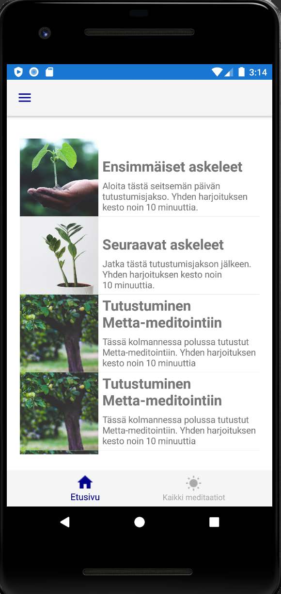

# MinunHetkeni
Simppeli pohja mobiilisovellukselle (Xamarin.forms -tekniikalla), johon voitaisiin myöhemmin ladata erilaisia meditointi ja läsnäolo harjoituksia.

Toteutettu demo-projektina Coding Bootcamp -koulutuksessa.

